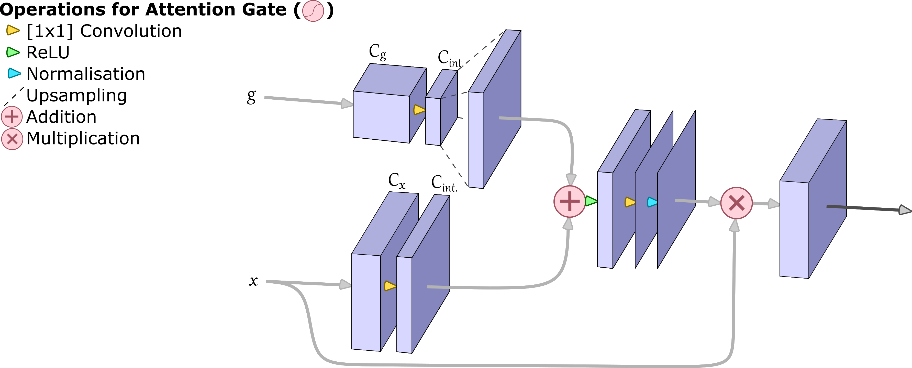
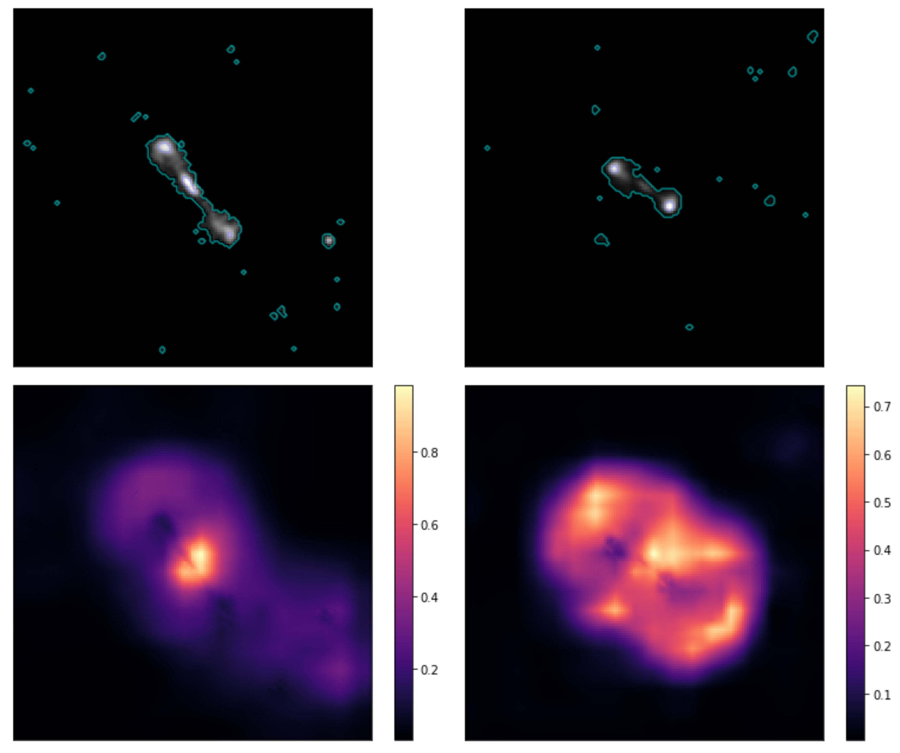
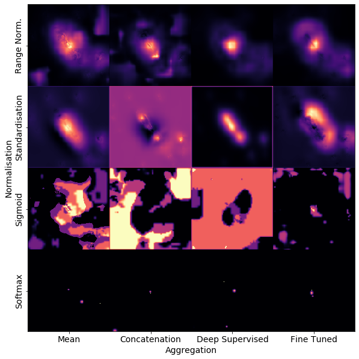
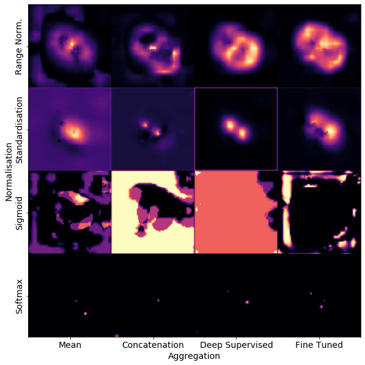
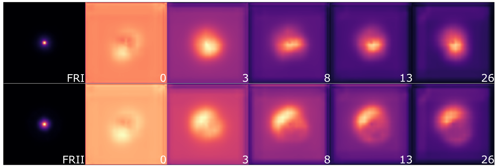
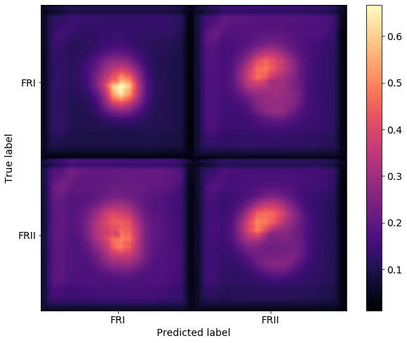

# AstroAttention
Learned attention for radio astronomy. 
This is the code used for Bowles (2020): "Attention-gating for improved radio galaxy classification".

The network implemented was adapted from [Ozan-Oktay's Github](https://github.com/ozan-oktay/Attention-Gated-Networks).

## Networks
The implemented network follows [Jetley (2018)](https://arxiv.org/abs/1804.02391).

The network contains (at most) ~101k parameters, and can be visualised as follows:


The attention gates are convolutional functions with two inputs. One from the final convolutional layer ($g$) and an input from an earlier layer ($x$). This calculates a scaling map (attention map / compatibility score), which scales input $x$. This is then used for the final classification. More details are seen in section 2.2 of the respective paper. The attention gate is visualised as:


## Files
In the [PYTHON](PYTHON/) folder, there are a number of files that are of interest to a given user. The below lists what they were used for, and what they contain.
- [Experiment 1](PYTHON/Experiment1.ipynb) evaluates and creates figures for the AG-CNN trained on FR-DEEP-F, MiraBest and MiraBest* (only certain sources).
- [Experiment 2](PYTHON/Experiment2.ipynb) evaluates the AG-CNN aggregation and normalisation variations.
- [Experiment 3](PYTHON/Experiment3.ipynb) evaluates the AG-CNN attention gate number variations.
- [Experiment 4](PYTHON/Experiment4.ipynb) evaluates the previous models across the entire data set, i.e. it considers the attention distributions.
- [Experiment 5](PYTHON/Experiment5.ipynb) highlights the sources which are consistently falsely classified by the selected model.
- [Training](PYTHON/training2.py) this is the training function called by [TrainModels.ipynb](PYTHON/TrainModels.ipynb), and was used for each of the presented models.
- [Train models](PYTHON/TrainModels.ipynb) this file demonstrates the function calls used to train each of the models.
- [utils.py](PYTHON/utils.py) contains (most) of the helper functions defined for this project, including evaluations, attention map extractions and plots.
- [Evaluating All Trained Models](PYTHON/EvaluatingAllTrainedModels.ipynb) will not run entirely without some modification. It was used to keep track of the improvements of various models throughout my research process.

## Results

Attention shows similar performance to the state of the art. The literature suggests, that this should have given a boost in performance over classic-CNN models. This discrepency is thought to arise due to the limited data sizes and the nature of the labeled data itself.

Attention gates can be investigated for individual sources. The sources and the attention gates for the proposed model ([experiment1.ipynb](PYTHON/experiment1.ipynb)):



For the aggregation and normalisation investigation ([experiment2.ipynb](PYTHON/experiment2.ipynb)), the following arrays of attention maps are produced:



One of the benefits of radio astronomy data being used for CNN classification, is that the object of interest can be classified (statistically) on its radial distribution. Thus by averaging the images across the entire data sets, and their respective attention maps, we can visualise how the attention is distributed on a set of images:
As well as for distributions of sources, such as:



## Usage
The trained models can be found in [this folder](PYTHON/) and are configured according to their file names. The models are trained on classifying radio galaxies between the two classes of FRI and FRII, and this is **all** of what they are meant to do.

To load the proposed model:
```python
path = '.../0709Exp1-range_norm-MiraBestNOHYBRIDAdam-AGRadGalNetft-5e-05'
model_name = path_to_model(p)
net = load_net(model_name, device)
```
A given 4-dimensional batch of images (`imgs`)of a radio source can be classified by the loaded model, by calling `net(imgs)`.
The dimensions must be: Height x Width x 1 x BatchSize, where 1 is the channel size (black and white). The image should also be normalised between -1 and 1.
This will return a tensor with predictions, which can be softmaxed for a final classificaiton. For each image a 'vector' of two elements will be returned, if the first entry is larger than the second, then the predicted class is FRI, else it is FRII.

## Data
[FRDEEP.py](PYTHON/FRDEEP.py) / [MiraBest.py](PYTHON/MiraBest.py) contain functions which accesss in the respective data sets.
FR-DEEP was first used in [Tang (2019)](https://www.semanticscholar.org/paper/Transfer-learning-for-radio-galaxy-classification-Tang-Scaife/f273f4d4e4ba956c83ff71fd7748dff22552d87b).
MiraBest was compiled by Fiona Porter, and was taken from [this GitHub repository](https://github.com/fmporter/MiraBest-full).

## Disclaimer
Many more models were trained throughout the investigation. The files presented in this repository are a selection of the files used throughout. Consider the .pickle files in [PYTHON](PYTHON/), which contain many more evaluations for models not presented here. These were generated and evaluated in turn throughout the research process, but are omitted for clarity.

Throughout training models resulted in other configurations than those presented in the paper. As an example of a strange attention model: The below attention map progression throughout training shows a model learning to classify on the zero-space around the respective sources.

